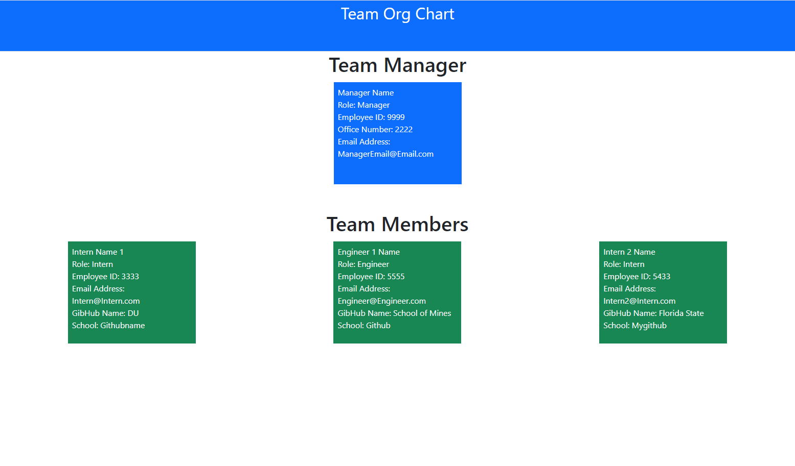

# 5-Day-Forecast 

## Description
Team Org Chart Generator using node.js and inquirer 

## Installation
To install, clone repo to your desktop 

## Usage
1. once cloned, run npm init then npm i to install the nessasary files. 
2. then open terminal and run "node server"
3. follow the prompts in the terminal until completed. 
4. Open Index.HTML file and review the output of your added team

## License

There is no license for this application 

## User Story
AS A manager  
I WANT to generate a webpage that displays my team's basic info  
SO THAT I have quick access to their emails and GitHub profiles  

## Acceptance Criteria: 
GIVEN a command-line application that accepts user input  
WHEN I am prompted for my team members and their information  
THEN an HTML file is generated that displays a nicely formatted team roster based on user input  
WHEN I click on an email address in the HTML  
THEN my default email program opens and populates the TO field of the email with the address  
WHEN I click on the GitHub username  
THEN that GitHub profile opens in a new tab  
WHEN I start the application  
THEN I am prompted to enter the team manager’s name, employee ID, email address, and office number  
WHEN I enter the team manager’s name, employee ID, email address, and office number  
THEN I am presented with a menu with the option to add an engineer or an intern or to finish building my team  
WHEN I select the engineer option  
THEN I am prompted to enter the engineer’s name, ID, email, and GitHub username, and I am taken back to the menu  
WHEN I select the intern option  
THEN I am prompted to enter the intern’s name, ID, email, and school, and I am taken back to the menu  
WHEN I decide to finish building my team  
THEN I exit the application, and the HTML is generated  

## Screenshot of Application:  

Team Org Chart Generator  

Video of Team Org Chart Generator being run  
[Untitled_ Jan 15, 2023 10_34 AM.webm](https://user-images.githubusercontent.com/114446244/212557923-8d1827b9-d8e9-4ae8-8cbb-056c2442decb.webm)
